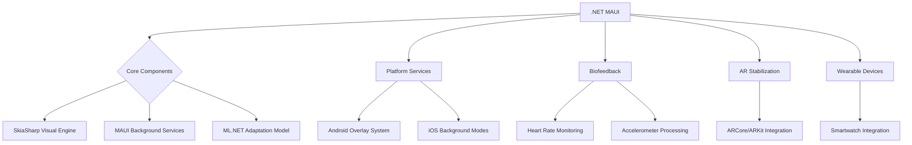

# MotionAid - Motion Sickness Stabilization Companion 🚗🌀

**Next-gen motion sickness prevention system with adaptive visuals, biofeedback integration, and background overlay support**

[](https://dotnet.microsoft.com/apps/maui)
[](https://learn.microsoft.com/en-us/dotnet/maui/)
[](LICENSE)

## 🌟 Features

- **Smart Overlay System**  
  Persistent stabilization visuals across all apps (Android)
- **Scientific Visual Therapies**
  - Dynamic dot fields 🌌
  - Horizon stabilization lines 🚢
  - Adaptive color temperature system 🌓
- **Biometric Integration**
  - Heart rate monitoring ❤️
  - Motion pattern analysis 📈
  - Stress detection algorithms 🧠
- **Background Service**  
  Continuous protection even when app is minimized
- **Personalized Adaptation**  
  ML-powered settings optimization (using ML.NET)
- **AR Stabilization**  
  Augmented reality-based stabilization techniques 🕶️
- **Wearable Device Integration**  
  Support for various wearable devices ⌚
- **Cross-Platform Overlay Solutions**  
  Consistent overlay experience across Android and iOS 📱

## 🛠️ Technology Stack



## 📱 Installation

### Android
```bash
# Requires overlay permission
adb shell appops set <package_name> SYSTEM_ALERT_WINDOW allow
```

### iOS  
*(Limited background capabilities due to platform restrictions)*

## 🚀 Getting Started

1. Clone repo
```bash
git clone https://github.com/swapnilpopatgaikwad/MotionSicknessApp.git
```

2. Restore packages
```bash
dotnet restore
```

3. Run Android emulator
```bash
dotnet build -t:Run -f net8.0-android
```

## 🌈 Customization

Edit `Themes/VisualPresets.json`:
```json
{
  "Themes": [
    {
      "Name": "Ocean Calm",
      "BaseColor": "#89CFF0",
      "PatternType": "Wave",
      "AnimationSpeed": 0.7
    }
  ]
}
```

## 🤝 Contributing

We welcome contributions in:
- AR stabilization implementations 🕶️
- Machine learning model improvements 🤖
- Wearable device integration ⌚
- Cross-platform overlay solutions 📱

See our [contribution guidelines](CONTRIBUTING.md) for details.

## 📄 License

MIT License - See [LICENSE](LICENSE) for details

---

**Disclaimer**: This app should not replace medical advice. Always consult healthcare professionals for severe motion sickness cases.

---